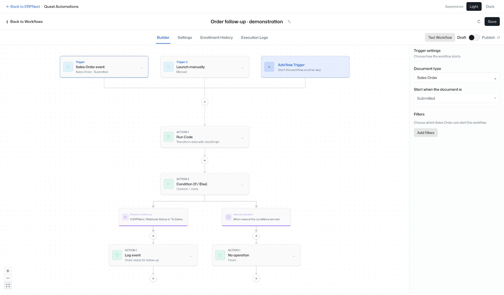
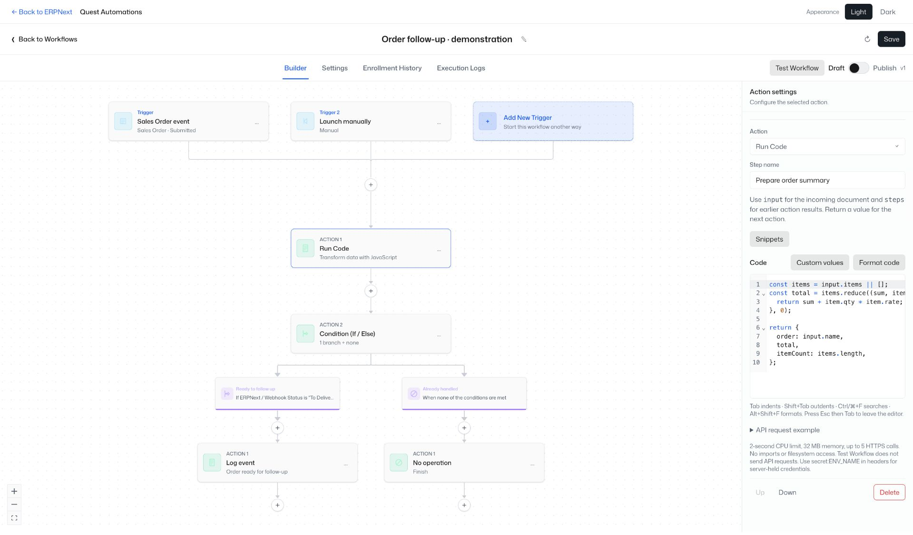

# Quest Automations for ERPNext

**n8n-style visual automation, built into ERPNext—with an API so agents can build workflows and humans can review them.**

Quest Automations adds a no-code workflow builder to your ERPNext site. Connect document events, webhooks, conditions, API requests, email, and optional JavaScript in one visual flow. An AI agent can create the same workflow through the API; a person can open it, inspect every trigger and action, test it, and publish it when ready.

This is an independent Frappe custom app, not n8n embedded in ERPNext or an n8n-compatible workflow importer.



## Agents build. Humans review.

1. **Discover:** an agent reads the action catalog and your site's live DocType metadata, including custom fields.
2. **Create a draft:** the agent sends a structured workflow definition to the API.
3. **Review visually:** a human opens that draft in the same editor used for manually built workflows. Field mappings, conditions, request bodies, and code are visible.
4. **Preview and publish:** test with sample data, review the results, then enable the workflow.
5. **Inspect runs:** follow the recorded outputs and errors when the workflow executes.

Creating a workflow does not publish it. Review-before-publish is a supported working process, not a separate enforced approval role: System Managers and their API clients can publish. Saving changes to an already active workflow currently republishes them; pause it before making changes that need another review. Automatic webhook setup saves only the draft.

## What you can automate

| Capability | What it does |
| --- | --- |
| Multiple triggers | Start a workflow manually, on an ERPNext document event, on a schedule, or from an incoming webhook. |
| DocType triggers | Select live DocTypes and add multiple filters. Custom fields, settings, and child-table types appear in the catalog. |
| Visual conditions | Route work through If/Else branches, with all/any matching, waits, and Go To steps. |
| ERPNext actions | Find, create, or update documents and apply ERPNext workflow actions. Child-table rows are edited through their parent document. |
| API requests | Configure None, Basic, Bearer, or API Key authentication; headers; query parameters; content type; and JSON, form, or raw bodies. Save responses for later field mapping. |
| Incoming webhooks | Adding a trigger automatically generates its URL. Capture a test event and use its fields in later actions. Production and test endpoints use separate secrets. |
| Send email | Use the site's outgoing Email Accounts, sender selection, recipients, Cc/Bcc, rich text, custom values, preview text, and ERPNext File attachments. |
| Run Code | Write JavaScript with CodeMirror: automatic brackets, indentation, highlighting, completion, folding, search, undo/redo, and Prettier formatting. Call external APIs with `await api.request(...)`. |
| Shared API | Agents and other clients create and edit the same definitions that the visual editor renders. |



Screenshots show demonstration workflows with example data, not customer records.

## ERPNext is the backend

The React editor is served by the Frappe app at `/automations`. Frappe provides authentication, the site database, document events, and background jobs. Workflows, versions, captured samples, and run history live in the **Automation Record** DocType and are included in normal site database backups.

**No Convex backend or subscription is required.** Some frontend validation/type imports remain from the original CRM editor; they do not connect to a Convex service. There is no separate automation server or SMTP connection to configure for native ERPNext operations.

Access currently requires **System Manager**. Runs execute as the user who published the workflow and respect that user's ERPNext permissions. The site scheduler and workers must be running.

## Install

Requirements: **Frappe v16, ERPNext v16, Python 3.14+**, and an environment that supports the `quickjs-ng` dependency and subprocesses. The native app has been installed and smoke-tested on a Frappe Cloud private bench. Other Frappe versions are not currently supported.

### Frappe Cloud private bench

1. Add `https://github.com/joscasjac/quest_automations` to your private bench group, using the `main` branch.
2. Deploy the bench and update the target site.
3. Open the site's **Apps → Install App** and install **Quest Automations**.
4. Sign in as a System Manager and open `https://your-site.example/automations`, or choose Quest Automations on the ERPNext desktop.

Adding an app to a bench and installing it on a site are separate steps. See [Frappe Cloud custom apps](https://docs.frappe.io/cloud/benches/custom-app) and [installing an app](https://docs.frappe.io/cloud/installing-an-app).

### Self-hosted Bench

From a compatible bench with ERPNext already installed:

```sh
bench get-app --branch main https://github.com/joscasjac/quest_automations
bench --site your-site.example install-app quest_automations
bench build --app quest_automations
bench --site your-site.example migrate
bench --site your-site.example enable-scheduler
```

Restart the bench's production services using your normal deployment process. Built frontend assets are committed, so installation does not require a separate frontend build.

### Appearance and navigation

The editor defaults to **Light**. Use **Appearance → Light / Dark** in the header; the preference is saved in that browser. **Back to ERPNext** returns to your site's desktop.

## API: create a workflow an agent can hand to a human

The native API endpoint is:

```text
POST /api/method/quest_automations.api.dispatch
```

Its JSON envelope contains `path`, `method`, and `body`. The HTTP request is POST; `method` selects the logical operation. Responses use Frappe's `message` envelope. Use a System Manager's standard Frappe token header: `Authorization: token API_KEY:API_SECRET`. Browser sessions use Frappe session authentication and CSRF protection. See [Frappe token authentication](https://docs.frappe.io/framework/user/en/guides/integration/rest_api/token_based_authentication).

```json
{
  "path": "api/v1/workflows",
  "method": "POST",
  "body": {
    "definition": {
      "schemaVersion": 2,
      "name": "Calculate order total — review draft",
      "triggers": [{"id": "manual", "kind": "manual"}],
      "steps": [{
        "kind": "custom_code",
        "label": "Calculate total",
        "code": "return { total: (input.items || []).reduce((sum, item) => sum + item.qty * item.rate, 0) };"
      }]
    }
  }
}
```

The response contains `message.id` and `message.revision`. Give the reviewer this URL:

```text
https://your-site.example/automations/app/workflows/WORKFLOW_ID
```

A runnable, draft-only Python client is included at [examples/create_review_draft.py](examples/create_review_draft.py). The portable definition is [examples/review-draft.json](examples/review-draft.json).

| Logical route | Method | Purpose |
| --- | --- | --- |
| `api/v1/catalog` | GET | Supported actions and triggers |
| `api/v1/doctypes` | GET | Live site DocType catalog |
| `api/v1/doctypes/Customer` | GET | Fields and custom fields for a DocType |
| `api/v1/workflows` | GET / POST | List workflows / create a draft |
| `api/v1/workflows/{id}` | GET / PUT | Read / update a draft; pass `revision` for updates |
| `api/v1/workflows/{id}/test` | POST | Preview with `input`; optionally `record: true` |
| `api/v1/workflows/{id}/publish` | POST | Publish the specified `revision` |
| `api/v1/workflows/{id}/pause` | POST | Pause new enrollment |
| `api/v1/workflows/{id}/run` | POST | Enqueue a published manual workflow; include `eventId` or `Idempotency-Key` |
| `api/v1/workflows/{id}/runs` | GET | Inspect recorded results |
| `api/v1/workflows/{id}/delete-trigger` | POST | Remove `triggerId`, with `revision`, and clean up its endpoint/sample/schedule |
| `api/v1/workflows/{id}/delete` | POST | Delete the workflow and related automation records, with `revision` |

The [OpenAPI document](quest_automations/openapi.json) describes the dispatch and webhook transport. The live `catalog` and DocType endpoints provide the available site capabilities.

## Webhooks and field mapping

Incoming webhook URLs use `/api/method/quest_automations.api.webhook?workflow_id=...&trigger_id=...`. Authenticate with **`X-Automation-Secret`**, not the user's ERPNext API token. Test capture adds `test=1` and uses its own secret. Click **Listen for test event**, send JSON within five minutes, then select its fields from Custom values. Test capture does not execute actions.

Reference incoming data as `{{trigger.field_name}}` and earlier action output as `{{steps.step_0.body.field_name}}`. In JavaScript, use `input` and `steps`. The visual picker discovers DocType fields and captured sample fields for you.

Deleting a saved trigger invalidates its endpoint, clears its captured sample and schedule, and cancels queued/waiting runs. Completed run history stays available until the workflow itself is deleted. Workflow deletion removes its versions, samples, schedules, and run records. Cleanup waits until active execution has finished; it cannot undo an external action already sent.

## Current boundaries

- OAuth2 is not included in this iteration.
- AI authoring happens through external API clients; there is no built-in model connection or AI writing service.
- Preview runs do not send external API requests or emails. Verify live integrations with a controlled published workflow.
- JavaScript has a 2-second CPU limit, 32 MB memory limit, and at most five HTTPS calls per action. Imports and filesystem access are unavailable.
- Use server environment references such as `secret:MY_API_TOKEN` for credentials. Literal values in workflow definitions are stored as workflow data and visible to System Managers.
- External requests use HTTPS and bounded DNS, redirect, body-size, and timeout checks. The API action also handles outgoing webhooks.
- Scheduling uses minute-resolution polling. Interrupted runs with uncertain side effects are marked for attention rather than automatically replayed.
- Nested If/Else blocks are not supported. This app is early-stage; validate important workflows in a staging site before relying on them.

## Development

```sh
cd frontend
npm ci
npm run build
```

The build writes assets to `quest_automations/public/ui`. Commit those assets with frontend changes.

In a Python environment with the app dependencies installed:

```sh
python -m unittest discover -s tests -v
```

These are native adapter/storage contract tests, including the JavaScript subprocess. They complement a real Frappe installation test; they do not replace it.

## License and credits

MIT. See [LICENSE](LICENSE). The original CRM editor's MIT notice is preserved in [LICENSE.crm](LICENSE.crm). The UI uses React, React Flow, CodeMirror, and Prettier. This project is independent of n8n and Frappe.
